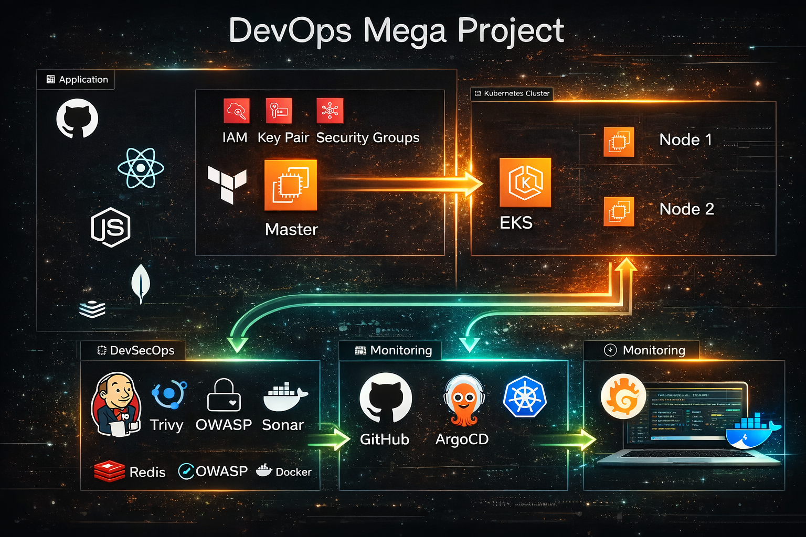
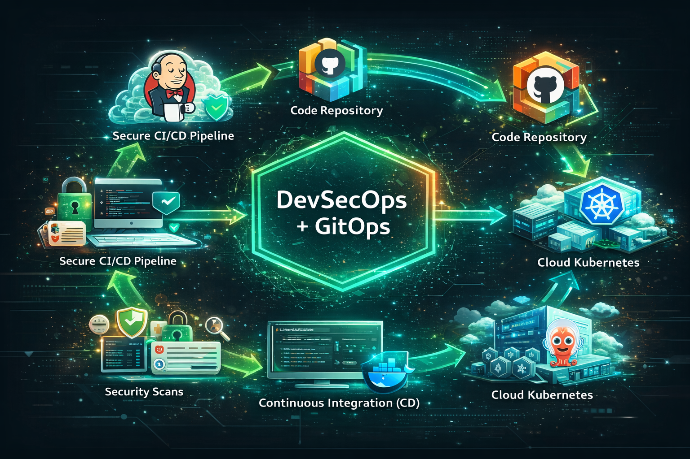

# DevOps Mega Project: From Code to Kubernetes - Building a Production-Grade DevSecOps + GitOps Platform

## A complete **production-grade DevSecOps pipeline** implementing CI/CD with security, automation, and Kubernetes deployment using **GitOps principles**.

This project demonstrates how a **3-tier MERN stack application** is deployed on **AWS EKS** using industry-standard tools.

#
### <mark>Project Deployment Flow:</mark>


#

## Tech stack used in this project:
- GitHub (Code)
- Docker (Containerization)
- Jenkins (CI)
- OWASP (Dependency check)
- SonarQube (Quality)
- Trivy (Filesystem Scan)
- ArgoCD (CD)
- Redis (Caching)
- AWS EKS (Kubernetes)
- Helm (Monitoring using grafana and prometheus)

## 🛠️ Tech Stack Used

---

### 🚀 Core DevSecOps Stack

<p align="center">
  
  
  
  
</p>

<p align="center">
GitHub • Jenkins • Docker • ArgoCD
</p>

---

### 🔐 Security & Code Quality

<p align="center">
  
  
  
</p>

<p align="center">
OWASP Dependency Check • SonarQube • Trivy
</p>

---

### ☸️ Kubernetes & Cloud

<p align="center">
  
  
  
  
</p>

<p align="center">
AWS EKS • Helm • Redis
</p>

---

### 📊 Monitoring & Observability

<p align="center">
  
  
</p>

<p align="center">
Prometheus • Grafana
</p>

---
### DevSecOps Architecture


---

### 🔄 CI/CD Flow



---

🔄 CI Pipeline (Jenkins)

✔ Code Checkout
✔ Trivy Filesystem Scan
✔ OWASP Dependency Check
✔ SonarQube Code Analysis
✔ Docker Image Build
✔ Docker Push to DockerHub

🚀 CD Pipeline (GitOps with ArgoCD)

✔ Update Kubernetes Manifests
✔ Push Changes to GitHub
✔ ArgoCD Auto Sync
✔ Rolling Deployment to AWS EKS
✔ Zero Downtime Deployment

---

🧠 Key Features

✅ DevSecOps Integrated CI

✅ Automated Vulnerability Scanning

✅ GitOps Deployment Strategy

✅ Kubernetes Rolling Updates

✅ Monitoring Enabled

✅ Email Notifications

✅ Secure Credential Handling

✅ Fully Automated End-to-End Flow


## 📸 Screenshots

### CI Pipeline


### CD Pipeline


### ArgoCD Deployment


## 📊 Monitoring & Observability

- Prometheus used for real-time metrics collection  
- Grafana dashboards for visualization of Kubernetes cluster and application performance  
- Monitored CPU, Memory, Pods, and Node-level metrics  
- Integrated alerting and performance tracking  

### 📸 Grafana Dashboard


---

## 📦 Project Flow

```text
Developer → GitHub → Jenkins (CI + Security Scan)
→ Docker Build → DockerHub → GitHub (Manifest Update)
→ ArgoCD → AWS EKS → Deployment 🚀
